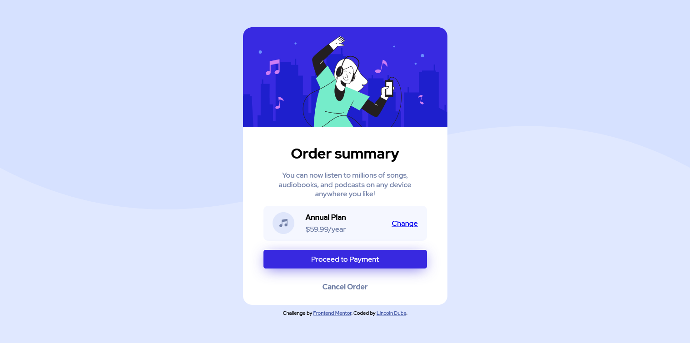

# Frontend Mentor - Order summary card solution

This is a solution to the [Order summary card challenge on Frontend Mentor](https://www.frontendmentor.io/challenges/order-summary-component-QlPmajDUj). Frontend Mentor challenges help you improve your coding skills by building realistic projects. 

## Table of contents

- [Overview](#overview)
  - [The challenge](#the-challenge)
  - [Screenshot](#screenshot)
  - [Links](#links)
- [My process](#my-process)
  - [Built with](#built-with)
  - [What I learned](#what-i-learned)
  - [Continued development](#continued-development)
  - [Useful resources](#useful-resources)
- [Author](#author)
- [Acknowledgments](#acknowledgments)

**Note: Delete this note and update the table of contents based on what sections you keep.**

## Overview

### The challenge

Users should be able to:

- See hover states for interactive elements

### Screenshot



### Links

- Solution URL: [](https://github.com/slickLink/order_summary_component_main)
- Live Site URL: [](https://order-component-solution.netlify.app/)

## My process

### Built with

- Semantic HTML5 markup
- SCSS - CSS with Powers
- Flexbox

### What I learned

This was my first time using SCSS for a project. 
I learned how to use SCSS variables and nested rules.

```scss
$main-color: #ccc;
.proud-of-this-css {
  color: $main-color;
  p {
    font-size: 16px;
  }
}
```

### Continued development

- SCSS mixins & functions
- Mobile first approach

### Useful resources

- [SASS/SCSS](https://sass-lang.com/documentation) - This helped me organize my css and prject colors

## Author

- Frontend Mentor - [@slickLink](https://www.frontendmentor.io/profile/slickLink)

## Acknowledgments

- None for this project
